# Architecture

How Smart-Clearance is built, as of 6 October 2026 (through SC-52). This document names every technology in the
solution and shows how the parts fit, with diagrams. [README.md](README.md) is the guide to running and operating
it; [AGENTS.md](AGENTS.md) holds the rules it is worked on by. The diagrams are Mermaid, which GitHub renders.

## Contents

1. [The system in one picture](#1-the-system-in-one-picture)
2. [Surfaces and their status](#2-surfaces-and-their-status)
3. [The technology, layer by layer](#3-the-technology-layer-by-layer)
4. [The design prototypes, design3](#4-the-design-prototypes-design3)
5. [The frontend](#5-the-frontend)
6. [backend-api](#6-backend-api)
7. [The data model](#7-the-data-model)
8. [Identity, secrets and security](#8-identity-secrets-and-security)
9. [Request paths](#9-request-paths)
10. [The cloud](#10-the-cloud)
11. [Delivery: CI, builds and deploys](#11-delivery-ci-builds-and-deploys)
12. [Local development](#12-local-development)
13. [Accessibility and motion](#13-accessibility-and-motion)
14. [The agents, planned](#14-the-agents-planned)
15. [Decisions and their reasons](#15-decisions-and-their-reasons)
16. [Known gaps](#16-known-gaps)

## 1. The system in one picture

Two static web apps on Firebase Hosting's CDN talk to one API on Cloud Run, which keeps everything in one Cloud SQL
database and checks staff sign-ins against Firebase Authentication. The design prototypes, on their own in-browser
mocks, are hosted on Claude Design. GitHub Actions and Cloud Build carry every change from `main` to the cloud without
a key.

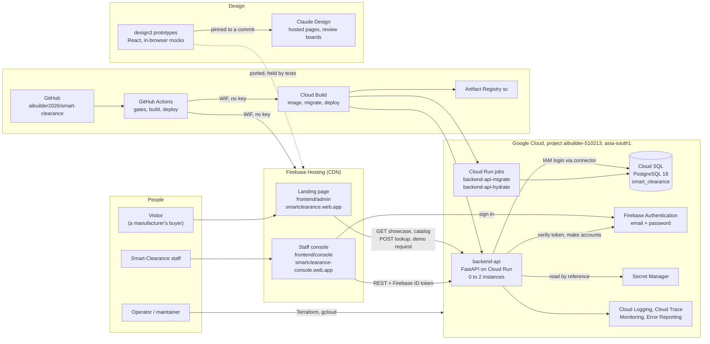

## 2. Surfaces and their status

| Surface | Prototype (design3) | Production | Backend |
| --- | --- | --- | --- |
| Design system v3 | `system/`, hosted on Claude Design | `frontend/core` (Svelte), and `/ds` on the landing page's dev server | none needed |
| Landing page, smartclearance.com | `site/`, hosted | `frontend/admin`, live on Firebase Hosting | backend-api: showcase, catalog, workspace lookup, demo requests |
| Staff console, console.smartclearance.com | `console/`, hosted | `frontend/console`, live on Firebase Hosting | backend-api: everything under `/v1/console`, with Firebase sign-in |
| A client's workspace app, `<client>.smartclearance.com` | `app/`, hosted (Munchly Foods, an installable PWA) | not ported yet | none yet |
| Guided demo | `demo/`, hosted | not planned as production | none |
| The agents | the mock in `core/platform.js` and `core/flow.js` | `agents/`, planned | will read `sc.batch_gates` |

## 3. The technology, layer by layer

Versions are those pinned in the lockfiles on 6 October 2026.

### Design and prototypes (`design3/`)

| Piece | Technology |
| --- | --- |
| Pages | Static HTML, React 18.3 and framer-motion 11 from a CDN, with every `.jsx` precompiled to `.js` by esbuild (`build.sh`); `dist.sh` bundles the hosted build |
| Styling | Plain CSS with design tokens (`system/tokens.css`, `base.css`, `components.css`, `screens.css`), light and dark |
| The hero's town | WebGL2, drawing a plate and its depth map with parallax, tilt and focus (`site/town.jsx`); flat where WebGL2 is missing |
| Money and data | `core/money.js` computes every figure from Journey Map v4.1; `core/data.js` is the fictional dataset; `core/platform.js` is the console's mock backend and the rules of record; `core/flow.js` the journey as actions with an agent reconciler; `core/store.js` the browser store |
| Loaders | `site/loader.js` (the landing page) and `console/splash.js` (the console), plain scripts loaded first in `<body>` |
| Imagery | Qwen-Image 2.1 renders and LTX 2.5 clips, each with a `.prompt.json` sidecar; PNG originals stay local, only WebP ships |
| Accessibility suite | Playwright 1.63 with @axe-core/playwright 4.13, five viewport and theme projects, plus keyboard and motion specs |
| Hosting | Claude Design projects load `dist/` from jsDelivr and images from GitHub raw, both pinned to a commit SHA |
| Design tooling | impeccable (design skill and reviewers), ui-ux-pro-max and the taste skills, Framer Motion for motion prototypes, ThreeUI Community components (MIT) through a local plugin, Claude Design review boards |

### Frontend (`frontend/`)

| Area | Technology |
| --- | --- |
| Framework | SvelteKit 3, Svelte 5 (runes), Vite 8.3, TypeScript 6.0, Node 22.17 or later |
| Workspace | pnpm 12.9 through corepack; five packages with one catalog of shared versions |
| Output | `adapter-static`: the landing page prerendered with its data (`index.html`, `200.html` as the SPA fallback); the console a client-side app |
| Styling | design3's CSS ported verbatim, with Tailwind 4's theme and utilities over its tokens (no preflight) |
| Primitives | bits-ui 2.19 for the menu and the sheet |
| Icons | Lucide (`@lucide/svelte`), through a registry generated from design3's icon names |
| Data | TanStack Query 6 over a typed API, `@smart-clearance/api`: HTTP when `PUBLIC_API_BASE` is set, else an in-browser mock seeded from design3 |
| Sign-in | `firebase/auth` 12.19, loaded only when `PUBLIC_API_BASE` is set |
| Motion | `motion` 14 (motion.dev) and Svelte transitions, with the prototype's springs (`core/src/lib/motion`) |
| Fonts | Fontsource variable fonts: Bricolage Grotesque, Geist, Geist Mono, Noto Sans Devanagari |
| Tests | Vitest 5 and Testing Library (unit, drift, seed, coverage, rules); Playwright 1.63 with axe-core (e2e, each app); pixelmatch (parity with design3) |
| Lint | ESLint 10 with typescript-eslint and eslint-plugin-svelte, Prettier 3 with its Svelte plugin, svelte-check 4.7 |

### backend-api (`backend-api/`)

| Area | Technology |
| --- | --- |
| Runtime | Python 3.14, managed by uv 0.12 (`uv.lock` committed); ruff for lint and format |
| API | FastAPI 0.142 on Uvicorn 0.54; Pydantic 2.13 and pydantic-settings for the schemas and configuration; slowapi for rate limits |
| Database access | SQLAlchemy 2.1 (async) on asyncpg 0.31; Alembic 1.20 migrations; `cloud-sql-python-connector` in the cloud |
| Identity | `firebase-admin` 7.7 verifies ID tokens and makes accounts; `google-auth` for the service's own credentials and local impersonation |
| Secrets | `google-cloud-secret-manager` 2.31, read by reference at runtime |
| Synthetic data | Faker 40 (`en_IN`), seeded |
| Logging | one JSON object a line when `LOG_FORMAT=json` (`logs.py`), for Cloud Logging and Error Reporting; a line written during a request carries its trace and span |
| Tracing | OpenTelemetry SDK 1.45 (`tracing.py`, SC-57), instrumenting FastAPI, SQLAlchemy and requests (0.66b1); the OTLP gRPC exporter to the Telemetry API (`telemetry.googleapis.com`), read in Cloud Trace |
| Container | `python:3.14-slim`, two-stage build with uv, runs as an unprivileged user on port 8080 |
| Tests | pytest 9 with pytest-asyncio and httpx, on a real PostgreSQL (`smart_clearance_test`), 214 tests |

### Data

| Store | Technology |
| --- | --- |
| The database | PostgreSQL 18: locally the developer's Docker container, in the cloud Cloud SQL (`sc-main`, Enterprise, `db-f1-micro`, zonal, 10 GB SSD, backups and point-in-time recovery). One database, `smart_clearance`, schema `sc` |
| Roles | `sc_owner` owns every object; `sc_app` has DML only and may not write reference data; the audit log is append-only by grants and triggers |
| Reference data | JSON in `src/sc_api/reference/`, written from design3 by `frontend/scripts/seed.mjs`, loaded at migrate time |
| Browser stores | the mocks keep their state in `localStorage` (`sc-console`, `sc-demo-requests`; design3's `sc3-platform`) |

### Identity, secrets and platform

| Piece | Technology |
| --- | --- |
| Sign-in | Firebase Authentication (Identity Platform): email and password only, sign-up disabled, a password policy and email enumeration protection; one user pool for local development and production |
| Secrets | Google Secret Manager, three containers made by Terraform and filled by a script on stdin |
| Service identity | service accounts without keys: `sc-api`, `sc-migrator`, `sc-api-local` (impersonated in code from a developer's credentials), `sc-builder`, `github-deployer`, `github-backend`; a custom role `scAuthUsers` for user management only |
| Compute | Cloud Run (service and two jobs), scaling to zero; Cloud Build; Artifact Registry |
| Hosting | Firebase Hosting, one site per app, with rewrites and headers from `frontend/firebase.json` |
| Observability | Cloud Logging (30 days), Error Reporting, Cloud Trace (sampled spans over OTLP, SC-57), Cloud Monitoring (an uptime check, seven alert policies, a dashboard), Cloud SQL Query Insights, a billing budget |
| Infrastructure as code | Terraform 1.9 or later with `hashicorp/google` and `google-beta` 8.5 and `integrations/github` 6.13; state in GCS; deletion protection on what would hurt to lose |

### Delivery and quality

| Piece | Technology |
| --- | --- |
| CI | GitHub Actions (`ci.yml`): frontend gate, infra gate, backend gate on `postgres:18`, gitleaks secret scan, one build; every action pinned to a commit SHA; a read-only token except where a job deploys |
| Cloud sign-in from CI | Workload Identity Federation, from the `prod` environment and this repository's numeric ids only |
| Backend releases | Cloud Build (`cloudbuild.yaml`): build and push, run the migrate job, deploy the service, check `/readyz` |
| Frontend releases | firebase-tools 15.32.1 through `npx`, in `infra/scripts/deploy.sh` |
| Work tracking | Jira project SC through the jira-flow plugin (branch, commit and PR patterns, gates, ship rules) |

## 4. The design prototypes, design3

design3 is the source of truth for every design. Its pages are the design system, the guided demo, the workspace
app, the landing page and the console, all built from one kit and one dataset. `demo/`, `app/`, `console/` and
`site/` reach `core/` and `screens/` through symlinks, so a change there affects every page.

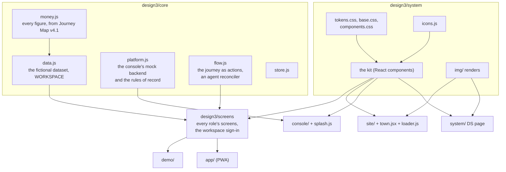

Two things flow from design3 into production, and tests hold them there:

- **The frontend** ports design3 page by page. The CSS is copied verbatim outside marked `@port` blocks, the seed and
  the icon registry are generated from `core/data.js`, `core/money.js` and `system/icons.js`, and each app's parity
  suite compares its build with the prototype pixel by pixel.
- **backend-api** loads design3's data as reference data (`seed.mjs` writes `src/sc_api/reference/`), and holds its
  Python rules to fixtures taken from `platform.js`.

Every design review lives in `design3/designs/SC-<n>/`: the options, comps, motion recordings, the review board and
the record of the maintainer's pick. The board is published to the surface's Claude Design project; only the picked
option is built.

## 5. The frontend

### The workspace

Two apps, each built and deployed on its own, over three shared packages. What the apps share is shared, never copied.

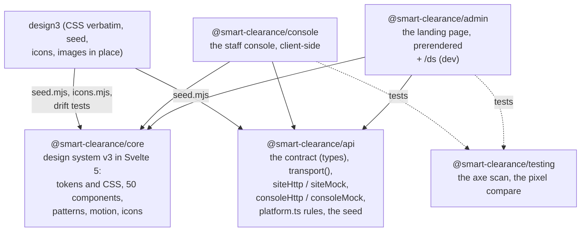

| Package | Entry points and what they hold |
| --- | --- |
| `core` | `ThemeProvider` (with the loader's gate), `Shell`, `Page`, `DataTable`, `Sheet`, `Menu`, `Tracker` and its variants, `Splash`, `Roll`, money and day formatting identical to `money.js`, the icon registry, the springs (`SPRINGS`: `tick`, `dot`, `token`), `coverage.ts` listing the kit pieces still to build |
| `api` | `@smart-clearance/api` (types, `ApiError`, `transport()`), `/site` (`SiteApi`), `/console` (`ConsoleApi` and the platform's rules), `/seed/*` |
| `admin` | `src/lib/landing/`: `Nav`, `Hero` with `Town` (`town/camera.ts`, `depth.ts`, `geo.ts`, `gestures.ts`, `graph.ts`), `How`, `Exits`, `Workspace`, `Plans`, `Close`, `Footer`, `DemoSheet`; `figures.ts` derives every figure and line of copy from the API; `hooks.server.ts` inlines design3's `loader.js` |
| `console` | `src/routes/` one per screen; `src/lib/screens/` (overview, client, loading placeholders); `src/lib/api/` with `firebase.ts`; `hooks.server.ts` inlines design3's `splash.js` and its CSS |
| `testing` | `a11y.ts` (the axe scan and report, and the components each scan had on screen), `a11y-coverage.ts` (every core component an app uses, scanned), `parity.ts` (pixelmatch against the prototype), `design3-server.py` (design3 for parity) |

### Rendering and data

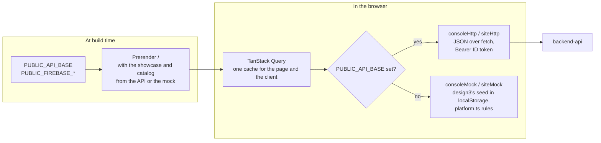

- The landing page is prerendered with its data, so it is complete without JavaScript, and every section is sent at
  rest. The hero's town is drawn in the browser from the plate's measured fit; without WebGL2 it is drawn flat.
- The console is a client-side app behind the staff sign-in. Until a staff member is signed in every route shows the
  sign-in in place, and the address is kept for after it. Routes are real paths, not the prototype's hash.
- Both apps keep one `app.html`, held identical by a test. Environment variables are declared in each app's
  `src/env.ts` and read from `$app/env/public`.
- A design change is made in design3 first, then ported. Drift tests fail when ported CSS departs from design3 outside
  marked blocks; `seed:check` and `icons:check` fail when generated files are stale.

## 6. backend-api

One FastAPI application, layered so that only the services write.

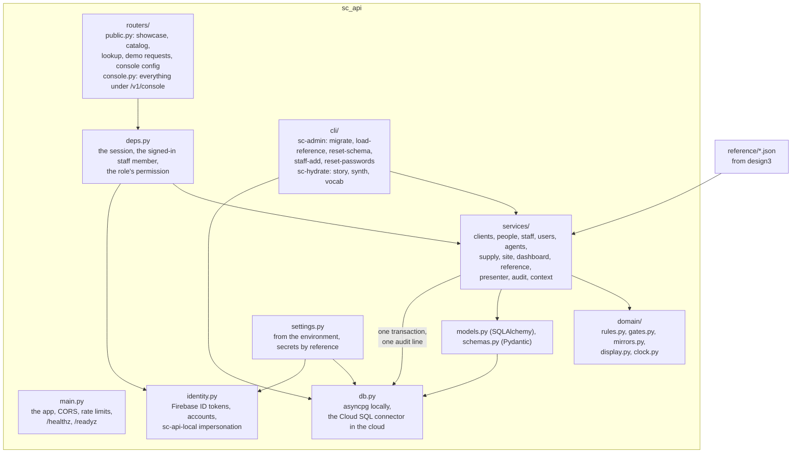

- **Routers** translate HTTP into service calls and errors into `{ message, fields? }`. Calls that return nothing
  answer 204; optional fields are absent, not null; times read as the prototype writes them, in India's time.
- **Services** are the only writers. Each change is one transaction with its audit line, in the acting person's name
  and the prototype's words. They also enforce what the prototype's mock did not: the approval step is always on, settings
  are checked against the console's fields, the approver is an active member, a locked exit stays off, plans must
  exist, reserved workspace addresses are refused.
- **Domain** holds the ported rules: the console's rules (`rules.py`, held to `platform.js` by fixtures), the
  quick-commerce gates (`gates.py`, held to the SQL view), the mirrors between a client's columns and the agents'
  settings, display formats and India's clock.
- **The CLI** is how operators and the Cloud Run jobs reach the services: `sc-admin migrate` runs Alembic and loads
  the reference data; `sc-hydrate` builds the synthetic world through the services and refuses any environment but
  local unless told its name (`--allow-env prod`).
- **Configuration** comes from the environment only (`SC_ENV`, `DB_MODE`, `DB_INSTANCE`, `DB_PASSWORD_SECRET`,
  `DEFAULT_PASSWORD_SECRET`, `SC_IMPERSONATE_SA`, `CORS_ORIGINS`, `LOG_FORMAT`, `STAFF_EMAIL_DOMAIN`). A secret is
  named by its Secret Manager reference and read into memory when first needed. `IDENTITY=fake` is only for the test
  suite.

## 7. The data model

One database, `smart_clearance`, schema `sc`, migrated by Alembic (`0001_baseline`, `0002_sku_batch_gates`,
`0003_batch_stage_at`). The main tables and how they relate:

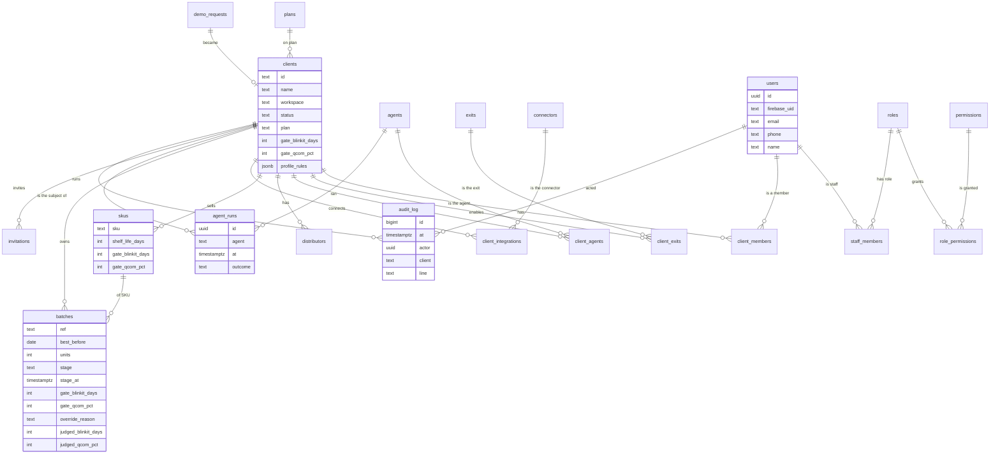

| Group | Tables | Notes |
| --- | --- | --- |
| Reference, loaded at migrate time | `plans`, `agents`, `connectors`, `exits`, `roles`, `permissions`, `role_permissions`, `documents` | from `src/sc_api/reference/`, which `seed.mjs` writes from design3; `rbac.json` by hand. `sc_app` may only read them |
| People | `users`, `staff_members`, `client_members`, `invitations` | one `users` row per person, with the Firebase uid |
| Clients | `clients`, `client_exits`, `client_agents`, `distributors`, `skus`, `client_integrations` | a client's gates, return window, territory guard, approver and staff-sale cap are typed columns; the JSON mirrors them into the agents' settings |
| Activity | `demo_requests`, `agent_runs`, `batches`, `audit_log` | `batches.stage_at` is when a batch reached its stop; the audit log refuses UPDATE, DELETE and TRUNCATE by trigger |
| For the agents | the view `batch_gates` | every open batch's quick-commerce gates, where each came from (override, SKU or client), and pass or fail, counting days from India's date |

**The gates rule** (SC-47): a batch's gates are its override, else its SKU's, else the client's default, value by value.
Blinkit wants days of shelf life left; Zepto and Instamart a share of the SKU's life, passed when
`days x 100 >= share x life`. An SKU keeps the profile's bounds (30 to 180 days, 30 to 90%); a batch's override may go
down to 7 days and 5%, needs a reason, and holds until its batch closes. The rule lives three times, held together by
fixtures: `design3/core/platform.js`, `frontend/api/src/console/platform.ts` and `backend-api/src/sc_api/domain/gates.py`
with the SQL view.

**The dashboard** (SC-48, SC-49) stores nothing: recovered by day, in flight, waiting for a yes, runs and Agents at
work are aggregates over `batches`, `agent_runs` and `clients` at read time.

## 8. Identity, secrets and security

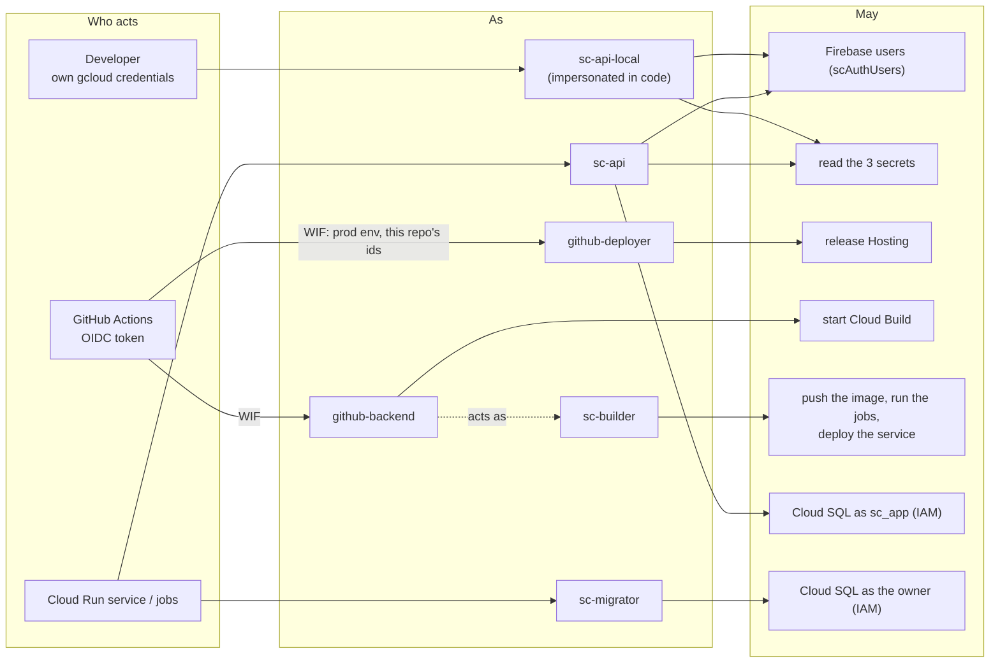

- **No key exists.** A developer's backend impersonates `sc-api-local` from their own credentials; CI exchanges
  GitHub's OIDC token for a service account's credentials, from the `prod` environment and this repository's numeric
  ids only; the cloud runtime uses its attached service accounts.
- **Secrets** live in Secret Manager only. Terraform makes the containers; a script fills them on stdin; the API reads
  them by reference. gitleaks scans every pull request. In the cloud there is no database password at all: Cloud SQL
  accepts IAM logins only, through connectors only, over TLS, with no authorised network.
- **Sign-in** is Firebase email and password with sign-up disabled, so only the API makes accounts, each on the
  default password that an operator hands over. Email enumeration protection makes every wrong sign-in answer the
  same. The password policy is 12 or more characters with mixed case and a digit.
- **Authorisation** is in the API: an ID token identifies an active staff member (anyone else is 401), and
  `reference/rbac.json` says what each role may do (a refusal is a 403 with a plain message). Super admin may do
  everything; Platform engineer and Support may set clients up and configure them, but not plans, going live or
  inviting staff.
- **Edges.** CORS allows only the Hosting sites in production (and the dev ports locally). The workspace lookup is a
  POST, rate-limited to 10 a minute per address, and names the workspace only. The console sends `noindex`,
  `X-Frame-Options: DENY` and a strict referrer policy. The console's browser key may call only the Identity Toolkit
  and Secure Token APIs, from the console's origins.
- **The audit log** is append-only by grants and by triggers that refuse UPDATE, DELETE and TRUNCATE even to the
  owner.
- **Deletion protection** is kept in state on the state bucket, both Hosting sites, the Cloud SQL instance and the
  Cloud Run service and jobs.

## 9. Request paths

### A staff member signs in and opens the Overview

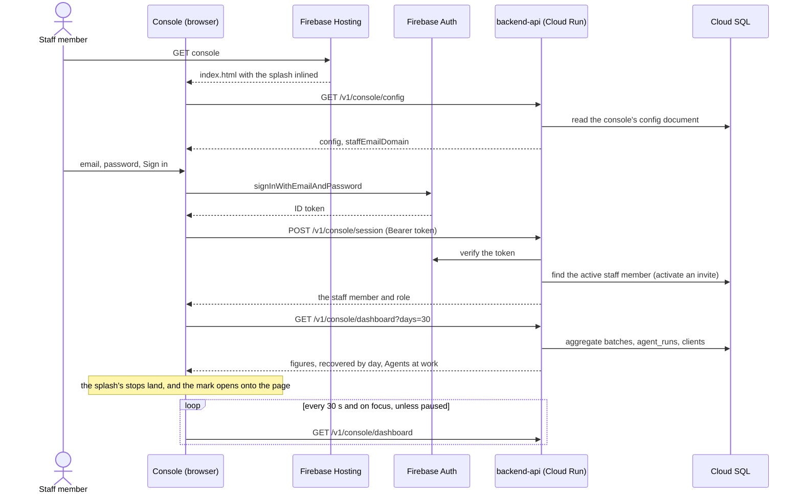

### A staff member changes an SKU's gates

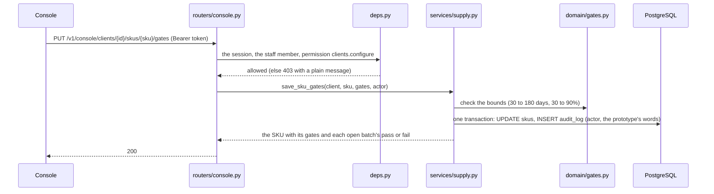

### A visitor books a demo

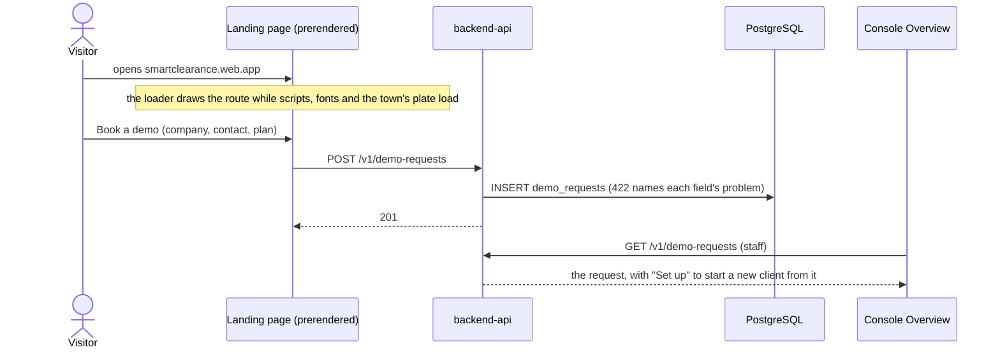

### One request, one trace

Every API call the apps make starts a trace (SC-57). Cloud Run keeps its id, and backend-api continues it, so the
call's log lines, spans and audit rows can be found from any one of them.

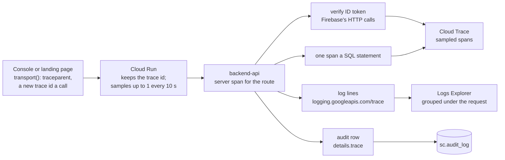

A request Cloud Run sampled is always traced, so the API's spans join Cloud Run's own; of the rest, a quarter
(`trace_sample_rate`). An unsampled request still has its trace id in its log lines and audit rows. A failed call's
`ApiError` carries the trace id in the browser.

## 10. The cloud

Everything is Terraform in `infra/`, in two roots: `bootstrap/` (the state bucket, holding its own state) and
`prod/` (everything else). Nothing is made by hand; what was (the billing link) is adopted by an `import` block.

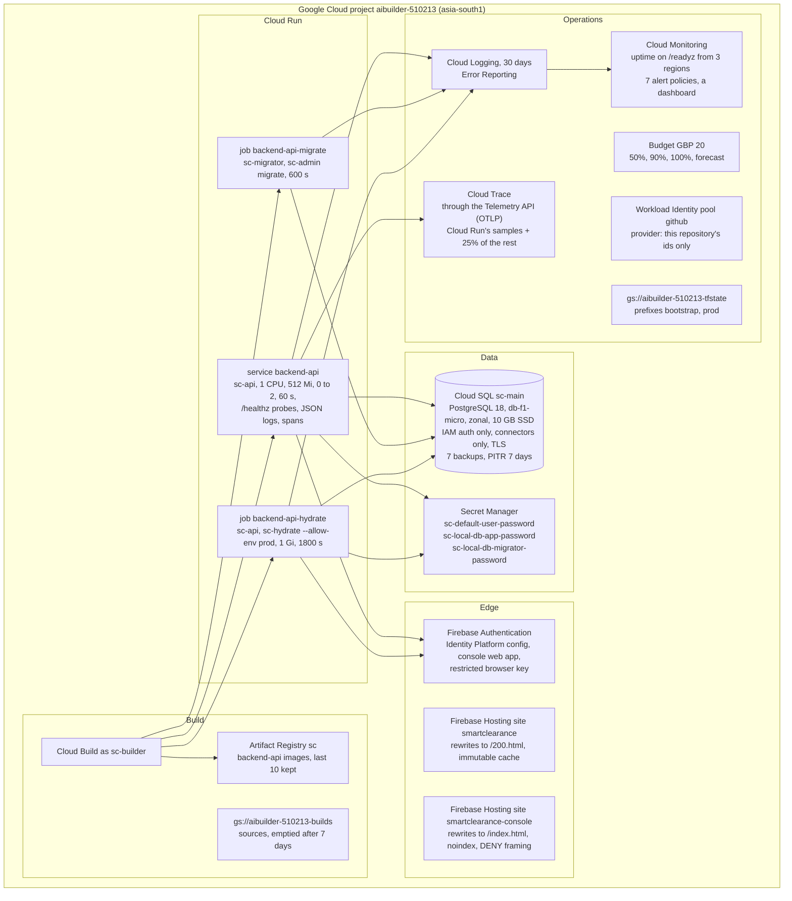

| File in `infra/prod` | What it holds |
| --- | --- |
| `project.tf`, `providers.tf`, `versions.tf`, `variables.tf`, `outputs.tf` | the APIs, the providers (google, google-beta, github), the GCS backend, the inputs and outputs |
| `hosting.tf` | Firebase on the project, one Hosting site per app, a custom domain per site when set |
| `deployer.tf`, `github.tf` | the Workload Identity pool and provider, `github-deployer`, the repository's `prod` environment and variables |
| `auth.tf` | the Identity Platform config, the console's web app and browser key |
| `secrets.tf`, `backend.tf` | the three secret containers; the `scAuthUsers` role and `sc-api-local`, which operators may impersonate |
| `sql.tf`, `run.tf`, `registry.tf`, `build.tf`, `monitoring.tf`, `budget.tf` | the runtime, behind `backend_runtime` |

The runtime costs about GBP 9 a month, nearly all Cloud SQL; everything else sits in free tiers at the prototype's
traffic.

## 11. Delivery: CI, builds and deploys

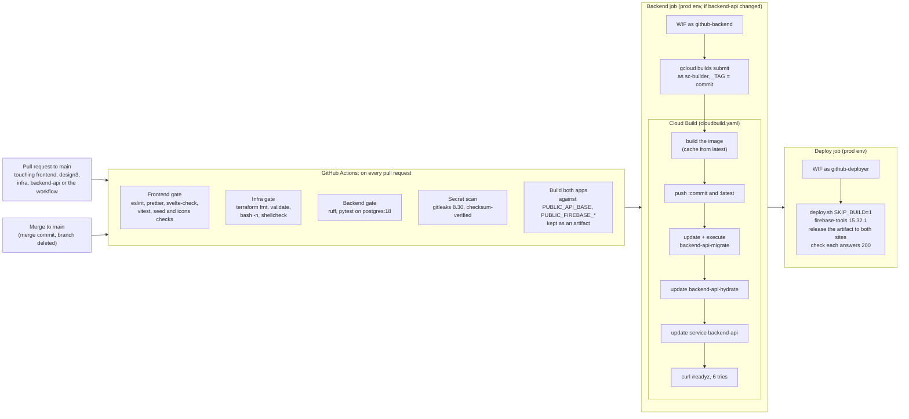

- Only `main` may deploy to `prod`, and deploys queue rather than overlap. A newer push to a pull request cancels its
  older run.
- Every action is pinned to a commit SHA, the workflow token is read-only, and only the two deploying jobs get
  `id-token: write`.
- Cloud Build owns the Cloud Run image; Terraform ignores it. Terraform itself runs from a workstation, as a person:
  CI checks the configuration but never plans or applies.
- The a11y, e2e and parity suites need browsers and run on a developer's machine, not in CI.

## 12. Local development

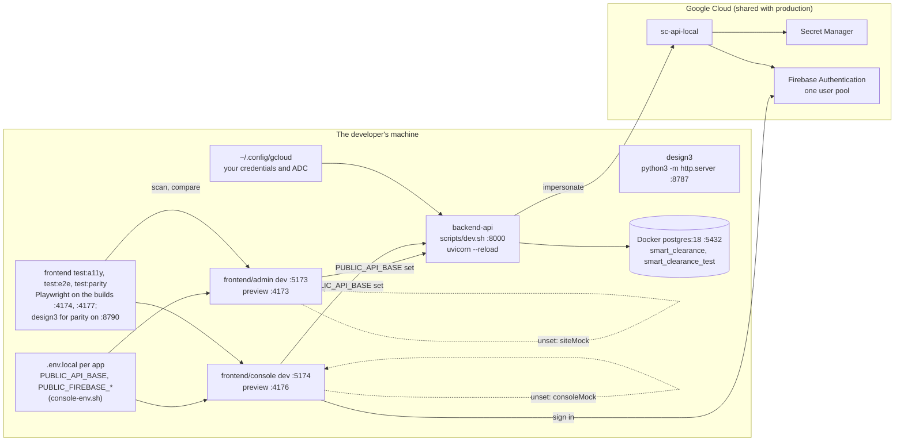

- The frontend runs in full without Google on its mocks; the mocks are seeded from design3 and keep state in the
  browser.
- A local backend-api is the real thing: the same code, the same Firebase user pool and secrets as production, on a
  local PostgreSQL. Scripts in `backend-api/scripts/` do every step (doctor, secrets, db-init, migrate, hydrate, dev,
  up, console-env, default-password, test, e2e, contracts, bootstrap), reading the project and region from
  `infra/prod/terraform.tfvars`.
- `up.sh` runs the API in its container, as Cloud Run does, with the developer's gcloud credentials mounted read-only.

## 13. Accessibility and motion

The target is WCAG 2.2 AA, held by the frontend's a11y suite on the production apps (SC-58). design3's prototypes are no longer scanned.

| Concern | How it is held |
| --- | --- |
| axe violations | zero, in `corepack pnpm test:a11y`: each app's build in five viewport and theme projects, never the `/ds` dev route; a coverage check fails the run if an app uses a core component no scan had on screen |
| Keyboard | specs for the console's sign-in, sheets and alerts taking and returning focus, the menu-button pattern, Book a demo's and the New client flow's errors, the town's tour, cards and panels |
| Motion (2.2.2) | every animation stops within five seconds; `motion.a11y.spec.ts` fails on an endless one. The exceptions are loading indicators (the landing page's loader, the console's loader, splash and placeholders) and the hero's 16.9 s tour, which plays once with Pause and Play and holds when the visitor has the camera or the hero is out of view |
| Reduced motion | every motion lands on its still frame at once |
| Contrast | measured against the pixels text actually sits on, including fills, tinted chips and plates, after any opacity |
| Pause for live data | the console's readings every 30 s can be paused, remembered per browser |
| Still manual | 2.4.11, 2.5.7, 3.2.6, 3.3.7 and 3.3.8 |

Motion is prototyped in Framer Motion in design3 and shipped in Svelte with `motion` and the same springs.

## 14. The agents, planned

The agents work the nine stops of a batch's journey. The approval is a person, never an agent. Today the agents exist
as the prototype's mock (`design3/core/platform.js`, `flow.js`), as rows in the console (each client's agents with
their autonomy, schedule and limits) and as the API's `batch_gates` view, written for them.

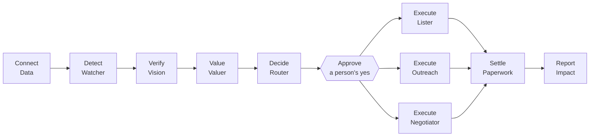

| Area | Planned choice (`agents/README.md`, `docs/smart-clearance-tech-stack.html`) |
| --- | --- |
| Runtime | Python, uv, ruff, pytest, on Cloud Run |
| Agents | Google's Agent Development Kit: one orchestrator, sequential where a step needs the last one's result, parallel where it does not |
| Models | Gemini on Vertex AI: Pro for reading labels and routing, Flash for drafts, offers and chat; structured output everywhere |
| Events | Cloud Pub/Sub (`batch.at_risk`, `offer.received`, `deal.closed`); runs resume from PostgreSQL |
| To the apps | server-sent events for the live agent feed, polling as the fallback; push through Firebase Cloud Messaging |
| Money | never a model's guess: the Valuer and Router apply Journey Map v4.1's rules as `money.js` implements them, which the port brings |
| Tracing | the same OpenTelemetry setup as backend-api's `tracing.py`: each Pub/Sub message carries the trace it was published in (a `traceparent` attribute), each agent run records its trace id, and Gemini calls are spans in it (SC-57) |

## 15. Decisions and their reasons

| Decision | Why |
| --- | --- |
| Design first, in design3, then port | one source of truth for designs, reviewed on a board before anything is built; tests hold the port to it (SC-26, SC-27) |
| A static SvelteKit build on Firebase Hosting, not SSR on Cloud Run | the apps are a prerendered page and a client-side app over an API; every byte is cacheable at the edge, and there is one fewer service (tech stack doc) |
| SvelteKit 3 and Svelte 5 | current; config in `vite.config.ts`, `#lib` imports, `src/env.ts` for environment variables (SC-27) |
| bits-ui directly, styled by design3's CSS; `motion` instead of framer-motion | the design system's own look, not shadcn's; framer-motion is React-only (SC-27) |
| TanStack Query over a typed API with an in-browser mock | the prerendered page and the client share one cache, and the mock becomes HTTP without touching a component (SC-27, SC-46) |
| FastAPI on PostgreSQL 18, Python 3.14 | current releases; PostgreSQL 18 is GA on Cloud SQL and is what the local container runs (SC-45) |
| Only services write, each with its audit line | one place for every rule, and an audit log that is complete by construction (SC-45) |
| Firebase email and password for everyone, no email ever sent | one shared pool, accounts made by the API on a default password an operator hands over; no mail infrastructure to build (SC-43) |
| Secrets by reference, no keys, IAM database logins | nothing secret in a file, a command line, state or git; local impersonation and Workload Identity Federation instead of keys (SC-44, SC-40, SC-50) |
| Cloud Run scaling to zero, `db-f1-micro` | about GBP 9 a month for a prototype; a cold start of a few seconds is masked by the console's splash (SC-50, SC-51) |
| Production starts with the synthetic world | the live console shows a working platform; hydrate builds it through the services, never by hand (SC-50) |
| Cloud Build releases the backend; firebase-tools releases the frontend; Terraform owns neither's content | the Hosting provider cannot upload files, and Cloud Build owns the image; Terraform ignores it (SC-39, SC-50) |
| Every plan saved, read in full, then applied | nothing in the cloud changes unread (SC-39) |
| OpenTelemetry over OTLP to the Telemetry API, sampled in the API | Google's recommended route into Cloud Trace (its Python Cloud Trace exporter is deprecated); keeping Cloud Run's sampled requests joins its spans to the API's; logs and audit rows carry every request's trace, sampled or not (SC-57) |
| WCAG 2.2 AA with zero axe violations and every motion under five seconds | held by suites on the prototypes and the apps, not by review alone (SC-18, SC-21) |

## 16. Known gaps

- The client's workspace app is not ported to `frontend/`; `core/src/lib/coverage.ts` lists the design-system pieces
  waiting for it. The app still judges batches by the client-wide gates in `money.js`, not the per-SKU gates.
- The agents service is planned, not built; `money.js` is not ported to Python yet, so the showcase is design3's
  computed figures loaded as content.
- Local development and production share one Firebase user pool. Cloud Run scales to zero (a cold start of a few
  seconds); Cloud SQL is a shared core without an SLA; the rate limiter counts per instance.
- No custom domain: the apps live on Firebase's own addresses, and the staff email domain is
  `smartclearance.example`.
- Terraform runs from a workstation; CI checks it but never plans. The a11y, e2e and parity suites are not in CI.
- The a11y suite covers what is built: the landing page and the console. The guided demo and the workspace app are prototypes only, and unscanned since SC-58.
  Firefox cannot start in a sandboxed shell.
- The hosted design pages on Claude Design run on their mocks; the deployed apps read backend-api.
- The landing page ships about 139 kB of JavaScript, gzipped; bits-ui and the icon registry are a third of it.
- The apps start a trace per API call, not per click, so a screen that reads three things leaves three traces. The
  hydrate and migrate jobs are not traced.
- The WCAG 2.2 criteria axe cannot check (2.4.11, 2.5.7, 3.2.6, 3.3.7, 3.3.8) await a manual pass.
